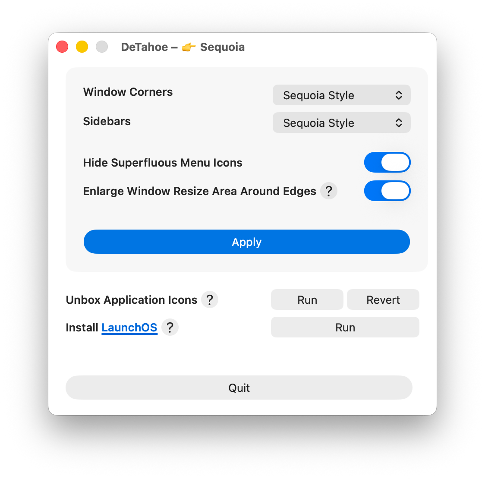

# DeTahoe
 
**Bring back the Sequoia look on macOS Tahoe.** DeTahoe is a small native macOS
app that reverses the most divisive visual changes Tahoe introduced, restoring
the feel of macOS Sequoia.
 
 
 
# What it does

DeTahoe is a single settings window. Tweak the change you want and click **Apply**. 

| Setting | What it changes |
| --- | --- |
| **Window Corners** | Sequoia's tighter corner radius vs. Tahoe's rounder default. |
| **Sidebars** | Sequoia's solid sidebars vs. Tahoe's floating glass appearance. |
| **Hide Superfluous Menu Icons** | Suppresses Tahoe's automatic menu-item icons for a cleaner menu bar. |
| **Enlarge Window Resize Area** | Widens the window-edge grab zones back to Sequoia-sized targets. |

### Unbox Application Icons

Tahoe masks every app icon to the system squircle, dropping free-form and legacy icons onto a gray rounded "box." **Unbox** installs each app's own icon as a custom Finder icon so it renders edge-to-edge again — the programmatic equivalent of dragging an icon into Get Info. **Revert** restores the defaults. Apps installed via the Mac App Store are unsupported and skipped.

### Install LaunchOS

Tahoe replaces Launchpad with an "Apps" button. DeTahoe can download and install [LaunchOS](https://launchosapp.com) — a Launchpad replacement — give it the classic Sequoia Launchpad icon, and pin it to the Dock right where the old Launchpad was placed. 
 

## License 
[MIT License](https://opensource.org/license/mit).
