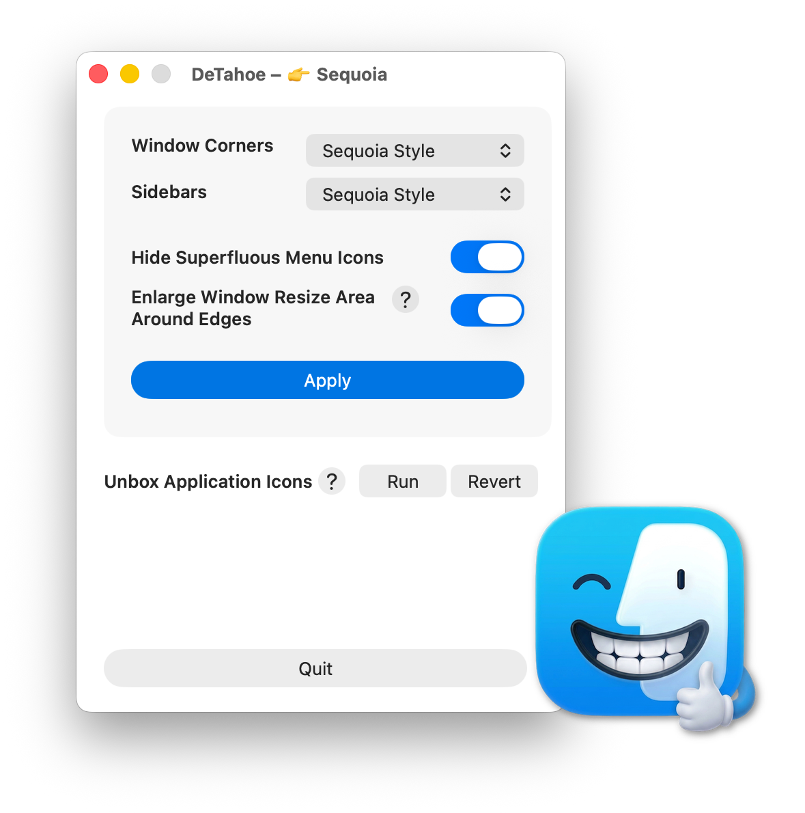
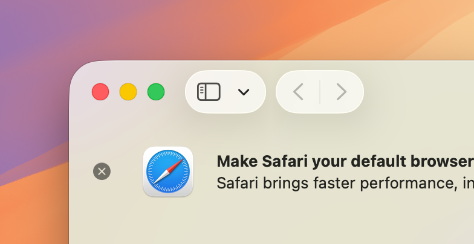
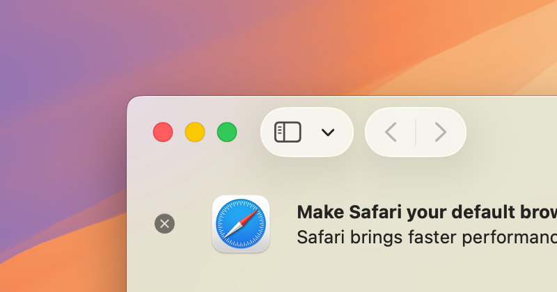
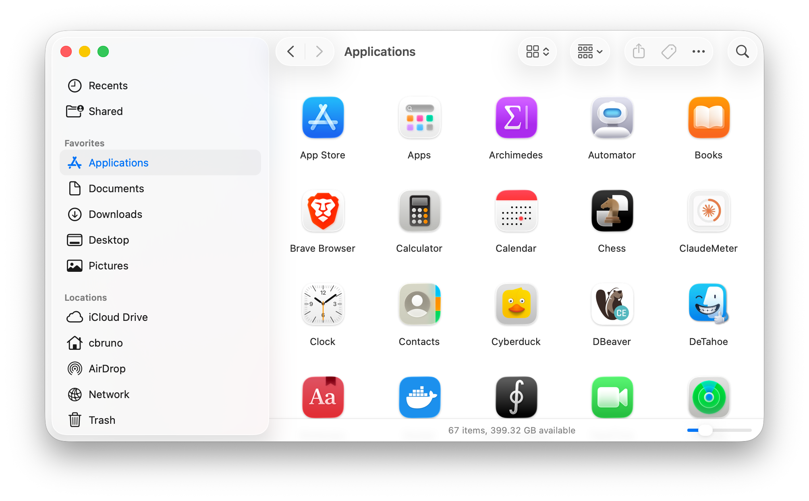
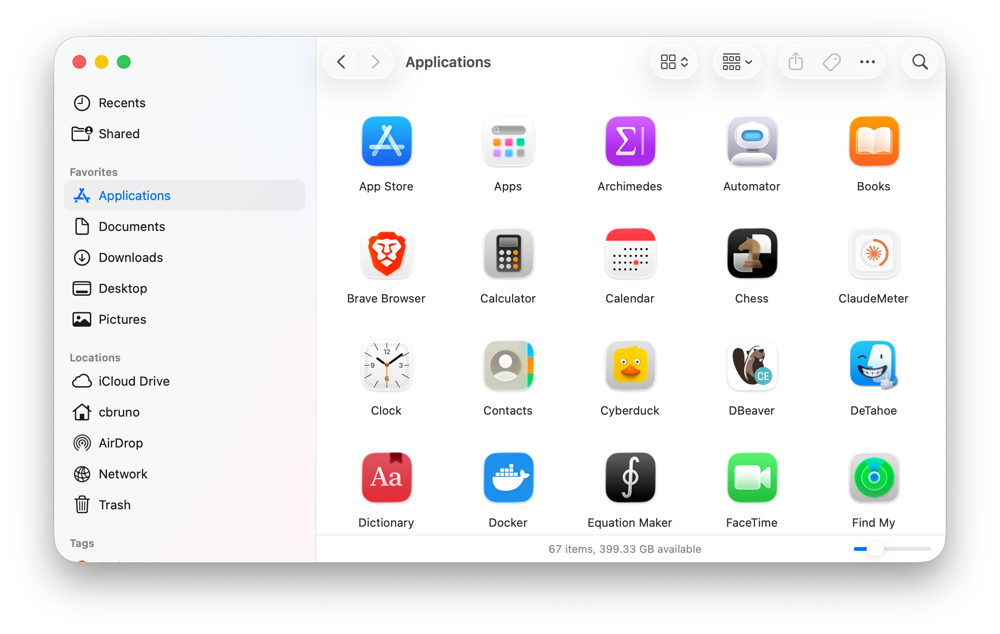
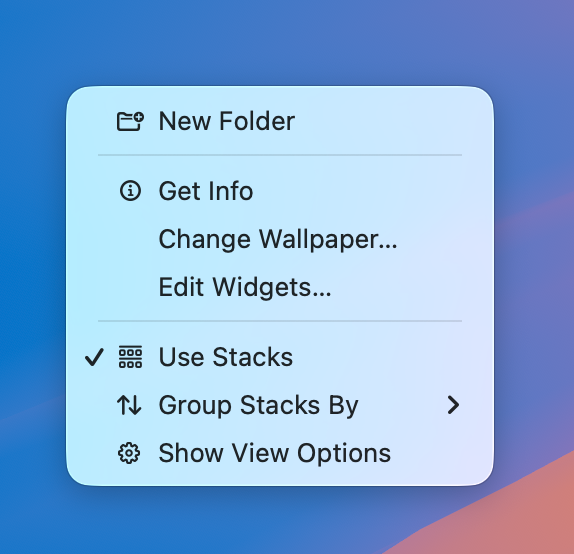
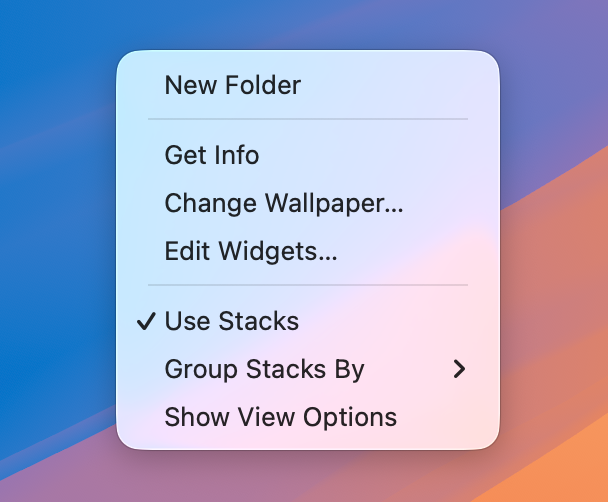
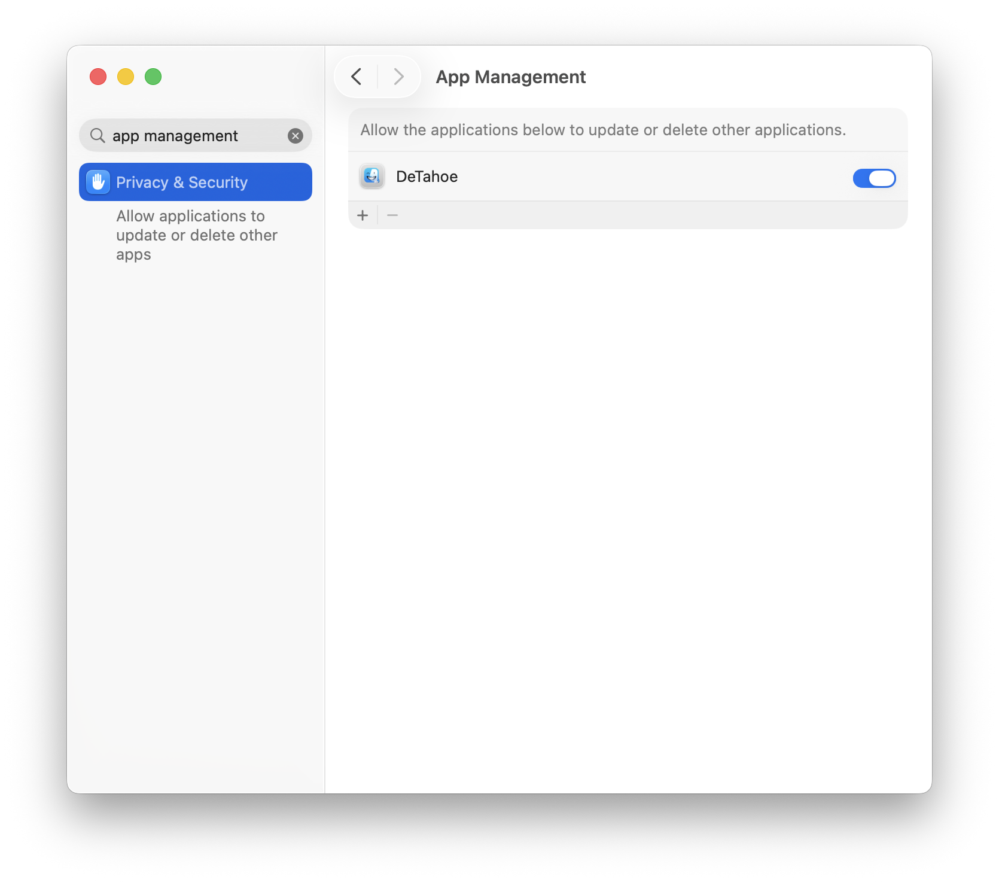
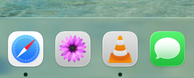
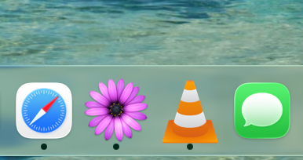

# DeTahoe

**Bring back the Sequoia feel on macOS Tahoe.** DeTahoe is a small macOS
app that reverses the most divisive visual changes Tahoe introduced, restoring
the feel of macOS Sequoia as much as possible.

### What it does

DeTahoe is a single settings window. Tweak the change you want and click **Apply**.

 

| Setting | What it changes | Tahoe → Sequoia |
| --- | --- | --- |
| **Window Corners** | Sequoia's tighter corner radius vs. Tahoe's rounder default. |   |
| **Sidebars** | Sequoia's solid sidebars vs. Tahoe's floating glass appearance. |   |
| **Hide Superfluous Menu Icons** | Suppresses Tahoe's automatic menu-item icons for a cleaner menu bar. |   |
| **Enlarge Window Resize Area** | Widens the window-edge grab zones back to Sequoia-sized targets. | — |

### App Management Permission

The following features modify other applications, which requires macOS's **App Management** permission. Open **System Settings → Privacy & Security → App Management**, then enable DeTahoe in the list. If DeTahoe is already listed but the change doesn't take effect, toggle it off and back on. You may be prompted to quit and reopen the app after granting access.

### Unbox Application Icons

Tahoe masks every nonstandard shaped app icon to the system squircle: free-form and legacy icons are placed inside a gray rounded "box." **Unbox** installs each app's own icon as a custom Finder icon so it renders edge-to-edge again — the programmatic equivalent of dragging an icon into Get Info. **Revert** restores the defaults. You can run Unbox anytime you add new Apps to the Application folder that need their free-form icon restored.

Apps installed via the Mac App Store are unsupported and skipped.

| Tahoe (boxed squircle) | Sequoia (free-form) |
| --- | --- |
|  |  |

### Install LaunchOS

Tahoe replaces Launchpad with an "Apps" grid. DeTahoe can download and install [LaunchOS](https://launchosapp.com) — a Launchpad replacement and pin it to the Dock right where the old Launchpad was placed. 
 

## License 
[MIT License](https://opensource.org/license/mit).
